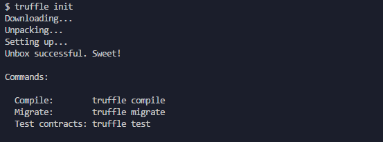

[home](../README.md)

# Smart Contract Deploying - Truffle

This document will guide you through installing a deploying a smart contract using `truffle`

1. First you will need to globally install `truffle@v4.1.0`
    1. For `npm`: `npm install -g truffle@4.1.0`
    2. For `yarn`: `yarn global add truffle @4.1.0`
2. For the purposes of this guide we will use truffle's built in template system to create a project with some boilerplate that all `truffle` projects require.
    1. Navigate to the directoy you wish to make this project and run `truffle init`. **Note**: `truffle init` must be run in an empty directory


3. Inside the folder you will notice some files have been generated for you.
The important one right now is `truffle.js` which is the config file that `truffle` uses to deploy contracts. For Halo related networks please copy and replace this `truffle.js` config into your project
```js
module.exports = {
  // See <http://truffleframework.com/docs/advanced/configuration>
  // to customize your Truffle configuration!
  networks: {
    development: {
      host: "127.0.0.1", // TestRPC/Ganache
      port: 8545,
      network_id: "5777"  // Change to your network id
    },
    devnet: {
      host: "127.0.0.1",
      port: {rpcport-here},
      gasPrice: 0,
      gas: 9000000,
      network_id: "*" // halo-devnet
    },
    qanet: {
      host: "127.0.0.1",
      port: {rpcport-here},
      gasPrice: 0,
      gas: 9000000,
      network_id: "425672638" // halo-qanet
    },
    testnet: {
      host: "127.0.0.1",
      port: {rpcport-here},
      gasPrice: 0,
      gas: 9000000,
      network_id: "42568378638" // halo-testnet
    },
    mainnet: {
      host: "127.0.0.1",
      port: {rpcport-here},
      gasPrice: 0,
      gas: 9000000,
	    network_id: "42566246638" // halo-mainnet
    }
  }
}
```
4. The next step is to create a smart contract! You can use your own or copy this one below
```js
// Greeter.sol

pragma solidity ^0.4.19; // pragma should match solc version used by truffle

contract Greeter is Mortal {
    /* Define variable greeting of the type string */
    string greeting;

    /* This runs when the contract is executed */
    function Greeter(string _greeting) public {
        greeting = _greeting;
    }

    /* Main function */
    function greet() constant returns (string) {
        return greeting;
    }
}
```
5. You will also need to edit `/contracts/Migrations.sol` to this:
```js
pragma solidity ^0.4.19;

contract Migrations {
  address public owner;
  uint public last_completed_migration;

  function Migrations () public {
    owner = msg.sender;
  }

  modifier restricted() {
    if (msg.sender == owner) _;
  }

  function setCompleted(uint completed) public restricted {
    last_completed_migration = completed;
  }

  function upgrade(address new_address) public restricted {
    Migrations upgraded = Migrations(new_address);
    upgraded.setCompleted(last_completed_migration);
  }
}
```
6. Next we will have to create a new file inside `/migrations/` called `2_deploy_contracts.js`. This is where `truffle` will migrate the smart contract onto the blockchain. An example of that file is below
```js
// 2_deploy_contracts.js

var Greeter = artifacts.require("./Greeter.sol");

module.exports = function(deployer) {
    deployer.deploy(Greeter, 'Hello') // Greeter expects a string passed to its constructor
}
```
7. Now we can compile the smart contract using `truffle compile`. This will create some new files but we care about: `/build/contracts/Greeter.json`
    1. `Greeter.json` will be a pretty large json file but we can focus on just 3 sections: abi, byteCode, and networks.
        1. Every smart contract has an ABI and it is an ethereum managed standard interface for smart contracts.
        2. The byteCode is the compiled version of the smart contract and is what is stored at the address that is returned when we deploy the contract
        3. Networks is where `truffle` manages and stores which networks the contract has been deployed to.
        
8. Finally we will deploy the smart contract to the chain with `truffle migrate --network qanet` (We are deploying to qanet since this is just a demo)
    1. The following snippet shows the transaction hash and the address of your newly deployed contract
    ```
    Deploying Greeter...
    ... 0xfac38d8a2864736ca2b06c6b30f2a02319d3397763cee543a36ee25ea65f2a28
    Greeter: 0x3feb13efe15abebac7c0d2c14cc2a923840f5a2a
     ```