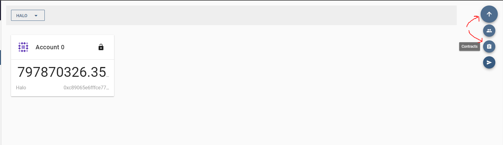
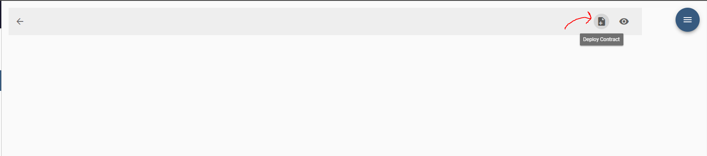
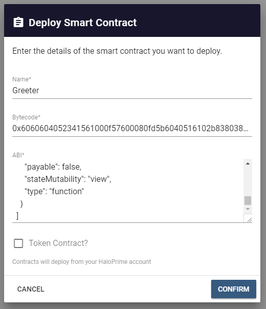
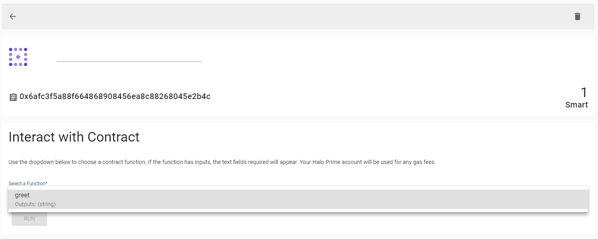

This document will guide you through installing a deploying a smart contract using the Halo wallet dapp

1. In order to deploy a contract from the wallet you need 2 pieces of info about your smart contract, the ABI and the byte code. These can be obtained by compiling a smart contract and while there are many ways to do this I recommend `truffle` and a guide to compiling smart contracts can be found [here](./smart-contracts-deploying-truffle.md) by following until step 7
2. Once you have the ABI and byte code you are ready to deploy the contract using the Halo wallet dapp.
3. Open `Featherlite`, login, and select the `Wallet` tab on the left hand side.
4. Navigate to the `Contracts` section of the dapp by using the speed dial in the top right corner and clicking `Contracts`

5. Next click on the `Deploy Contract` button

6. A dialog will appear and you simply copy and paste your byte code and ABI from step 1 and give the contract an easy to remember name and you are done!
    1. You can choose to deploy an ERC20 compatible smart contract and there are some additional fields, but this will be a separate guide.

    
7. From here you can click on the smart contract and interact with its methods on the Contract Detail View
